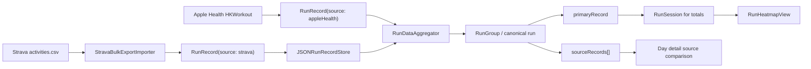
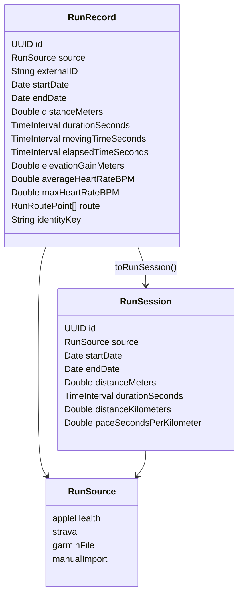
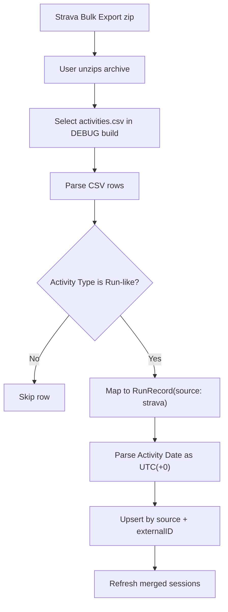
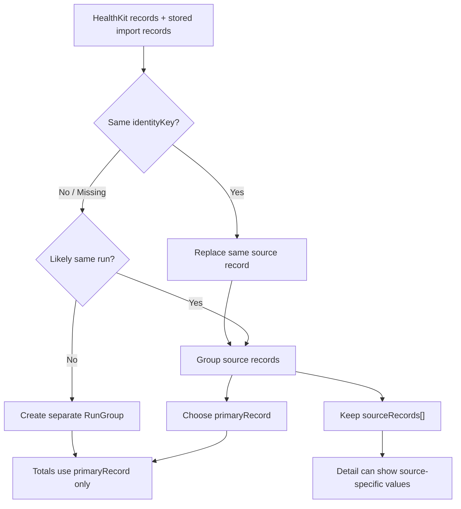
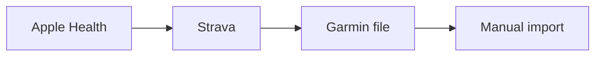
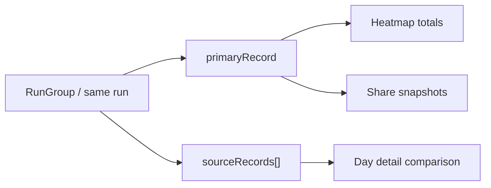
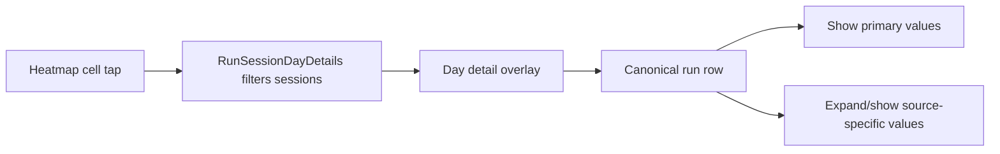

# Multi-source Running Data 설계

이 문서는 RunHeat가 Apple Health, Strava Bulk Export, 향후 Garmin 파일 import 같은 여러 러닝 데이터 출처를 하나의 화면 모델로 합치는 구조를 설명합니다.

## 목표

- Apple Health를 기본 데이터 소스로 유지합니다.
- Apple Health에 없는 외부 러닝 기록은 RunHeat 로컬 저장소에 보강 기록으로 저장합니다.
- 화면은 기존 `RunSession` 중심 구조에서 시작하되, 궁극적으로는 같은 러닝에 연결된 source별 원본 값을 상세에서 비교할 수 있게 합니다.
- 히트맵, 일/주/월/연 합계, 공유 이미지는 중복 source를 합산하지 않고 대표 기록만 사용합니다.
- HealthKit에는 쓰지 않고 읽기 전용 접근만 유지합니다.

## 전체 구조

## 모델 역할

`RunRecord`는 여러 출처의 원천 데이터를 RunHeat 내부 구조로 정규화한 모델입니다. `RunSession`은 화면 표시와 공유 기능이 사용하는 모델이며, 대표 출처(`source`)와 상세 비교용 source snapshot(`sourceDetails`)을 유지합니다.

같은 러닝으로 판단된 `RunRecord`들은 `RunGroup` canonical run 단위로 묶습니다. 이 그룹은 집계에 사용할 `primaryRecord`와 상세 비교에 사용할 `sourceRecords[]`를 함께 보관합니다.

## Strava Bulk Export Import

현재 import는 `activities.csv`만 처리합니다. `Filename`으로 연결되는 GPX 경로 파일은 아직 파싱하지 않습니다. Strava Bulk Export의 `Activity Date`는 UTC(+0) 기준으로 해석하고, 화면 표시는 기기 로컬 시간대에 따릅니다.

## 병합 및 중복 제거

`identityKey`는 `source + externalID`입니다. 같은 Strava `Activity ID`를 다시 import하면 로컬 저장소에서 같은 기록을 교체합니다.

서로 다른 출처 사이의 중복은 다음 근접 조건으로 판단합니다.

- 시작 시각 차이 60초 이하
- duration 차이 60초 이하
- 거리 차이 `max(50m, 더 긴 거리의 2%)` 이하

중복으로 판단되면 집계에 사용할 대표 기록을 하나 정합니다. 대표 출처 우선순위의 초기값은 다음과 같습니다.

따라서 Apple Health와 Strava에 같은 러닝이 있으면 히트맵 합계에는 Apple Health 기록만 반영합니다. Strava 기록은 같은 러닝의 보조 source로 보존되어야 하지만, 합계에는 더해지면 안 됩니다.

## 대표값과 source별 값 정책

- 집계용 값은 `primaryRecord` 하나만 사용합니다.
- 히트맵 셀 색상, 일/주/월/연 합계, 기간 공유 이미지는 모두 대표 기록 기준입니다.
- 같은 러닝을 여러 앱에서 기록했더라도 source별 거리를 합산하지 않습니다.
- 상세 화면은 `sourceRecords[]`를 표시할 수 있어야 합니다.
- source별 시작 시각, 거리, duration, pace가 다르면 상세에서 각 source 값을 나란히 확인할 수 있어야 합니다.
- 대표값 정책은 전체 기록 단위에서 시작하되, 향후 거리/시간/경로/심박처럼 필드별 신뢰 source를 분리할 수 있습니다.

현재 구현은 `RunGroup`에서 대표 `RunRecord`를 `RunSession`의 집계/공유 값으로 전달하고, 같은 그룹의 source별 값은 `RunSession.sourceDetails`로 함께 전달합니다.

## 화면 표시

현재 상세 오버레이는 canonical run별 대표 시작 시각, 거리, 페이스와 함께 작은 대표 source badge를 표시합니다. 같은 러닝에 여러 source가 연결되어 있으면, 그 아래에 source별 시작 시각, 거리, 페이스를 작은 줄로 함께 표시합니다.

목표 구조에서는 같은 러닝 아래에 source별 값을 함께 보여줍니다. 예를 들어 Apple Health와 Strava가 같은 러닝으로 묶였고 pace가 다르면, 상세에서는 두 source의 거리/시간/페이스를 모두 확인할 수 있어야 합니다. 다만 히트맵과 합계는 계속 대표 기록 하나만 사용합니다.

## 현재 한계와 다음 확장

- Strava CSV만 import하므로 route, GPX time, 시계열 심박은 아직 활용하지 않습니다.
- 현재 구현은 source별 route, 심박 시계열 같은 고해상도 상세 비교는 아직 표시하지 않습니다.
- 다음 구조 확장은 `RunGroup`의 필드별 신뢰 source 정책과 상세 화면의 source 비교 UI를 확장하는 방향이 자연스럽습니다.
- GPX import를 추가하면 CSV `Activity Date`보다 GPX `<time>`을 우선 사용해 시간 정확도를 높일 수 있습니다.
